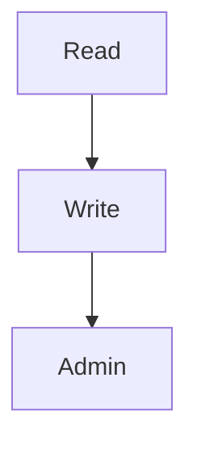

# Common Terminologies
**Repository**: A unit of storage and change tracking that represents a direcotry whose contents are tacked by Git

**Brach**: A version of a repository that represents the current state of the set of files that constitute a repository

**Master**: The frault or main branch, it is a version of the repository that is considered the single source of truth

**Refrence**: A Git ref or reference is a name corresponding to a commit hash

**HEAD**: A reference to the most recent commit on a branch

**Working Tree**: This refers to the section in which we view and make changes to the files in branch

**Index**: This is an area where Git holds files that have been changed, added, or removed in readiness for a commit

**Commit**: This is an entry into Git's history that represents a change made to a set of files at a given point in time

**Merge**: A merge is the process of incorporating change from one branch to another

**Workflows**: Workflows refer to the approach a team takes to introduce changes to a code base.

## Workflows
**Gitflow workflow**
- This uses two branches: master and develop
- The master branch is used to track release history, while the develop branch is used to track feature integration into the product.

**Centralized workflow**
- This approach uses the master branch as the default development branch.
- The changes are committed to the master branch.
- It's a suitable workflow for small size teams and teams transitioning from Apache Subversion.
- In Apache Subversion, the trunk is the equivalent of the master branch.

**Feature branch workflow**
- In this workflow, feature development is carried out in a dedicated branch.
- The branch is then merged to the master once the intended changes are approved.

**Forking workflow**
- The individual seeking to make a change to a repository, makes a copy of the desired repository in their respective GitHub account.
- The changes are made in the copy of the source repository and then it's merged to the source repository throught a pull request.

# Navigating GitHub
## Organizations
**Role-based membership**
- Each personal account that is added to an organization can belong to one of the aforementioned roles.

- The owner role is the most superior and is used to conduct administrative procedures.
**Repository level permissions**

- Teams or their respective members can be assigned read, write, or admin-level permissions to a repository.
- Each level dictates activities that the assigned members undertake, with a varying degree of limitations.
**Teams**
- There are members of an organization that can be grouped into teams, with the option of nesting the teams to match an organization's structure.
**Multi-factor authentication**
- Organizations support the enforcement of two-factor authentication as well as business-specific single sign-on approaches such as **Security Assertion Markup Language (SAML)** and **System for Corss-domain Identity Management** (SCIM).
### Market place install codacy

# Runtime config
Git configurations are set in three levels:
- System-wide configuration
   - set in the **/etc/gitconfig** file
   - access use **git config --system**
- User specific configuraton
   - ~/.gitconfig
   - git config --global
- Repository-specific configuration
   - Repository specific settings are set in the **path_to_repository/.git/config**
   - An example of configuration is the GitHub URL of a repository, which set at this level.
   - There settings are accessed via **git config --local**

## Removing configuratoin

```
git config --global --unset [section_name].[section_variable]
```
exampel: 
```
git config --global --unset user.name
```
create a ssh key:
```
ssh-keygen -t rsa -b 4096 -C foobar@cwzhou.win
```
# Fundamentails of repositories
**Tags**
There are used for the purpose of identifying specific significant points on a repository's history.

- lightweight tages
Lightweight tags act as pointers to a specific commit. It only stores the reference to the commit: **git tag v2.5**

- annotated tags
Annotated tags act as pointers to a specific commit and additionally store information about the creator of the tag, the email, and date of creation:
   **git tag -a v2.6 -m "Support sdk version 3"**

# Versioning Commits
In git, files can have the following statuses:
- Untracked: This is a file that exists in the working tree whose changes are not being monitored by Git and aren't listed in the **gitignore** file.
- Unstaged: This is a file whose changes are being tracked by Git; the file has been changed since the last commit and has yet to be moved to the **index**.
- Staged: This is a file whose changes are being tracked by Git; the file has been changed since the last commit and has been moved to the index.

```
git status
```
- It's used to retrieve the details of files that are untracked, unstaged, or staged.
- **git status** lists files in order of their statuses.
- The **git status** output is lengthy in nature
- To view a brief list and status, use the **-s** or **--short** option with the **git status** command.
```
szhou@armitage:~/DevOps/github/foobar|master
⇒  git branch ft-add-encapsulating-class
szhou@armitage:~/DevOps/github/foobar|master
⇒  git checkout ft-add-encapsulating-class
Switched to branch 'ft-add-encapsulating-class'
```
ft is feature branch, bg for bug, fs for rolling out hard fixes, ch for
``` 
git add . && git commit -m "Added a class for match functions" && git push origin ft-add-encapsulating-class
```
**git diff**
- The git diff command is uesed to compare one snapshot of changes to another.

zoom in the change:
```
szhou@armitage:~/DevOps/github/foobar|ft-add-encapsulating-class⚡
⇒  git diff
szhou@armitage:~/DevOps/github/foobar|ft-add-encapsulating-class⚡
⇒  git diff src/lib
szhou@armitage:~/DevOps/github/foobar|ft-add-encapsulating-class⚡
⇒  git diff src/lib/compute.py
```

Undo the change
```
git rest --hard
```
```
git diff HEAD -- src/
git log
git diff master
git diff --cached
git diff ft-add-encapsulating-class..ft-support-multiplication-arithmetic
```
**git add**
- is used to add files to the index from the working tree.
- syntax: **git add [options] [path_to_files]**

The options used with **git add** include **-n** and **--dry-run**: simulates the behaviour of git add for the specified file.

**-f** or **--force**: adds ignored files to the index.

**-i** or **--interactive**: creates an interactive prompt that can be used for adding files from the working tree to the index.

**-por --patch**: caters for adding portions of a file to the index.

**options**:
- ?: Print help
- y: Stage this hunk
- n: Do not stage this hunk
- q: Exit or quit. Do not stage this hunk or any of the remaining hunks.
- a: Stage this hunk and all later hunks in the specified files
- d: Do not stage this hunk or any of the remaining hunks in the file
- g: Select a hunk to go to
- /: Search for the hunk that matches the specified regex pattern
- j: Leave this hunk undecided; see the next undecided hunk
- J: Leave this hunk undecided; see the next hunk
- k: Leave this hunk undecided; see the previous undecided hunk
- K: Leave this hunk undecided; see the previous hunk
- s: Split the current hunk into more granular hunks
- e: Manually edit the current hunk

**git commit**
- The **git commit** command saves the files in the index.
- The commit operation stores a message along with the commit.
- This message describes the additions or alterations associated with the created snapshot.

Note: the **git commit** command requires that a message be provided for each commit operation.
**options**:
- -m [text] or --message [text]: associate the index file with the commit action
- -a or -all: stage tracked files that are unstaged
- -p or --patch: interactive patch tool
- -C [commit hash] or --resue-message=[commit hash]: resue a commit message and the author information of the specified commit hash
- -F [file] or --file=[file]: specifies a file from which a commit message should be obtained
- -t [file] or --template [file]: specifies the commit message template file
- -e or --edit: edits the provided commit message
- --no-edit: uses the specified message as is
- --author=[author]: overrides the details fo a commit author
- --date=[date]: overrides the data details used in a commit
- -q or --quiet: suppresses the summary message that's returned after running the **git commit** command

**git rm**

The **git rm** command performs two roles.
- Removes files from the working directory and the index
- Remove files from index
```
vim src/lib/scientific.py
git add . && git commit -m "Added sci module"
git rm src/lib/scientific.py
git status
git commit -m "Removed sci module"
```

**git mv**
- used to rename or move a file or a directory
- This command has two forms of implementation:
  - git mv [options][source][destination]: used to rename a file
  - git mv [options][source]...[destination]: used to move a file

**git log command**
```
git log --follow src/lib/advanced/advanced_compute.py
git log --decorate=full
git log --decorate=short
git log --decorate=no
git log -L 6,12:src/lib/compute.py
git log -n 3
git log -3
git log --skip=4
git log --since=01/01/2018
git log --pretty=oneline
git log --pretty=short
git log --pretty=medium
git log --pretty=format:"%H %an"
```
## Amending commits
The most recent commit can be edited using the --amend option of the **git commit** command.
```
git commit --amend
git rebase -i HEAD~4  # retrv the last 4 commits
pick 721d2ec Removed sci module
pick fc150d2 Added sci module
pick 4be4d85 Rename scientific module
pick 9a8a4ea Moved scientific module

change pick to reword save and quit the file.

## change the file
git rebase -i HEAD~3
change pick to edit save and quit the file.
vim src/lib/advanced/advanced_compute.py
git status
git add .
git commit --amend
git rebase --continue
git log -4
```
[CS Visualized: Useful Git Commands](https://dev.to/lydiahallie/cs-visualized-useful-git-commands-37p1)

# Git merge with No-Fast-Forward technique
```
git-demo-project git:(demo-branch) ✗ git commit -am "commit 1 from demo-branch"
[demo-branch 0280912] commit 1 from demo-branch
 1 file changed, 1 insertion(+)
 create mode 100644 test-no-ff-merge-file
➜  git-demo-project git:(demo-branch) echo 'line 2' >> test-no-ff-merge-file
➜  git-demo-project git:(demo-branch) ✗ git commit -am "commit 2 from demo-branch"
[demo-branch ca0b8d0] commit 2 from demo-branch
 1 file changed, 1 insertion(+)
➜  git-demo-project git:(demo-branch) git log --oneline
➜  git-demo-project git:(demo-branch) cat test-no-ff-merge-file
line 1
line 2
➜  git-demo-project git:(demo-branch) git checkout master
Switched to branch 'master'
➜  git-demo-project git:(master) git log --oneline
➜  git-demo-project git:(master) ls
readme.md  testffmergefile  test.html
➜  git-demo-project git:(master) git diff master demo-branch
➜  git-demo-project git:(master) git merge demo-branch --no-ff
Merge made by the 'recursive' strategy.
 test-no-ff-merge-file | 2 ++
 1 file changed, 2 insertions(+)
 create mode 100644 test-no-ff-merge-file
➜  git-demo-project git:(master) cat test-no-ff-merge-file
line 1
line 2
➜  git-demo-project git:(master) git log --oneline --decorate --graph
➜  git-demo-project git:(master) git branch -d demo-branch
Deleted branch demo-branch (was ca0b8d0).
```
